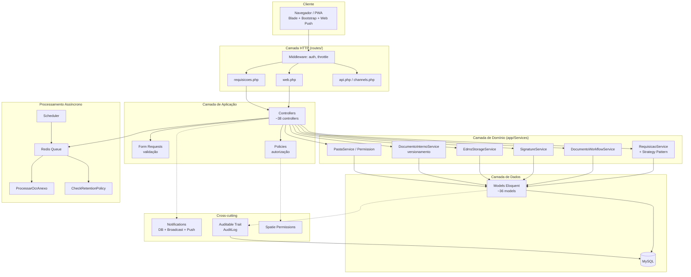
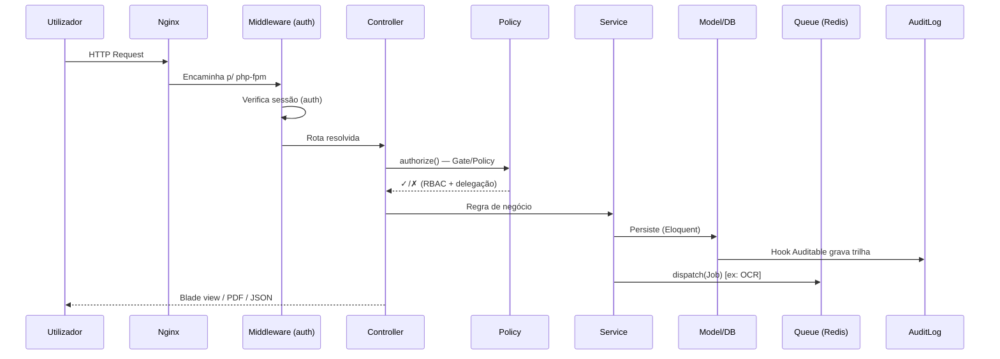
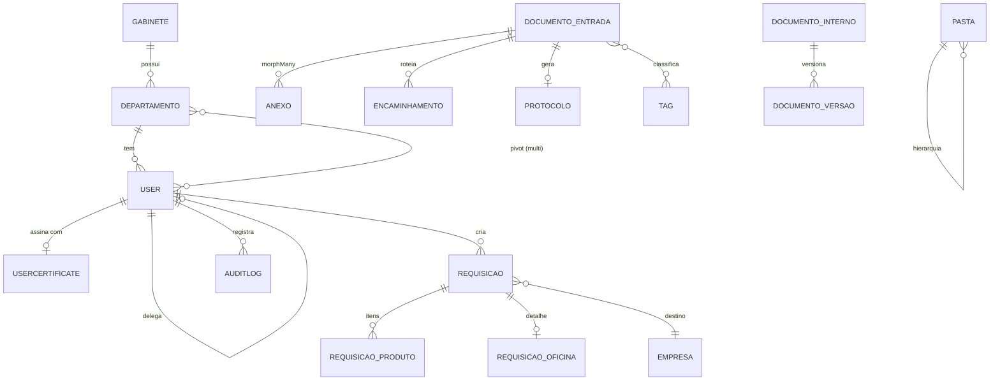
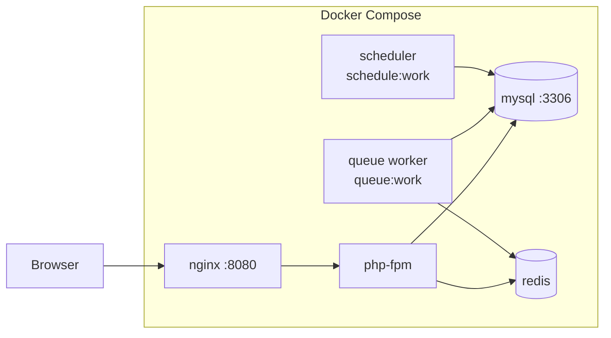

# Arquitetura do Sistema — GPN-AGIL

> Sistema de Gestão Administrativa e Documental do **Governo Provincial do Namibe (GPN)**.
> Documento gerado a partir da análise do código-fonte. Os diagramas usam [Mermaid](https://mermaid.js.org/)
> e são renderizados automaticamente no GitHub e no VS Code.

---

## 1. Visão Geral

O **GPN-AGIL** é uma aplicação **Laravel 12 (PHP 8.2+)** monolítica, *server-side rendered* (Blade +
Bootstrap), que digitaliza a gestão administrativa de um órgão público. Cobre gestão documental
(entrada e interna), requisições, frota, reservas de espaços, credenciais e termos de entrega, com
recursos transversais de **assinatura digital, workflow de aprovação, OCR, RBAC e auditoria**.

### Stack tecnológica

| Camada | Tecnologia |
|--------|-----------|
| Backend | Laravel 12, PHP 8.2 |
| Frontend | Blade Templates, Laravel UI, Bootstrap |
| Banco de dados | MySQL 8.0 |
| Cache / Filas | Redis 7 |
| Permissões (RBAC) | `spatie/laravel-permission` |
| Geração de PDF | `barryvdh/laravel-dompdf` |
| Exportação Excel | `maatwebsite/excel` |
| OCR | `thiagoalessio/tesseract_ocr` + `smalot/pdfparser` |
| QR Code | `simplesoftwareio/simple-qrcode` |
| Web Push | `minishlink/web-push` |
| Assinatura digital | OpenSSL (certificados P12) |
| Infraestrutura | Docker (nginx, php-fpm, mysql, redis, queue, scheduler) |

---

## 2. Arquitetura em Camadas



### Padrões de projeto

- **Strategy** — `RequisicaoStrategyInterface` com implementações para Produto/Oficina/Serviço/Passagem,
  orquestradas por `RequisicaoContext`. (`app/Services/Requisicao/`)
- **Service Layer** — regras de negócio isoladas dos controllers. (`app/Services/`)
- **Policy-based Authorization** — 6 policies registadas em `app/Providers/AuthServiceProvider.php`.
- **Observer** — `RequisicaoObserver` + eventos Eloquent para invalidação de cache em `AppServiceProvider`.
- **Trait Auditable** — auditoria automática via hooks `created/updated/deleted` (`app/Traits/Auditable.php`).

---

## 3. Estrutura de Diretórios

```
GPN-AGIL/
├── app/
│   ├── Http/Controllers/        # ~38 controllers (+ Auth, Admin)
│   ├── Http/Requests/           # Form Requests (validação)
│   ├── Services/                # Lógica de negócio (Strategy, Workflow, Signature, EDMS)
│   ├── Models/                  # ~36 models Eloquent
│   ├── Policies/                # Autorização por recurso
│   ├── Enums/                   # StatusRequisicao, TipoRequisicao, UserRole, DocumentoStatus, PastaTipo
│   ├── Jobs/                    # ProcessarOcrAnexo, CheckRetentionPolicy (assíncronos)
│   ├── Notifications/           # DB + Broadcast + Web Push
│   ├── Observers/               # RequisicaoObserver
│   ├── Traits/Auditable.php     # Trilha de auditoria automática
│   └── Providers/               # App, Auth, Event, Route, Broadcast
├── routes/
│   ├── web.php                  # Rotas web autenticadas + verificação pública de documentos
│   ├── requisicoes.php          # Rotas de requisições (4 tipos)
│   ├── api.php                  # API (auth:sanctum)
│   └── channels.php             # Canais de broadcast privados
├── resources/views/            # ~26 módulos Blade
├── database/migrations/        # ~90 migrations
└── docker/                     # nginx, php, mysql, redis, queue, scheduler
```

---

## 4. Módulos Funcionais

| Módulo | Função |
|--------|--------|
| 📥 **Documentos de Entrada** | Protocolo, encaminhamento (interno/externo), visto departamento + gabinete, tarefas, relacionamentos, OCR de anexos |
| 📝 **Documentos Internos** | Editor com modelos, workflow (rascunho → análise → aprovado → assinado), versionamento, assinatura digital, verificação pública por hash |
| 📋 **Requisições** | 4 tipos (Produto, Oficina, Serviço, Passagem) com aprovação e assinatura |
| 🗂️ **EDMS** | Sistema de arquivos: pastas hierárquicas, versões, partilha, streaming, política de retenção |
| 🚗 **Viaturas** | Frota + fotos + relatórios PDF/Excel |
| 🏢 **Departamentos / Gabinetes** | Estrutura organizacional + dashboards dedicados |
| 📅 **Reservas de Espaços** | Calendário + aprovação + visto de departamento |
| 🎫 **Credenciais / Termos de Entrega** | Geração de documentos com PDF |
| 👤 **Admin / RBAC** | Gestão de utilizadores, permissões e dados da instituição |
| 🔔 **Notificações** | Dropdown + página dedicada + Web Push |

---

## 5. Ciclo de Vida de uma Requisição HTTP



---

## 6. Modelo de Dados (entidades centrais)



### Pontos-chave do domínio

- **Estrutura organizacional**: `Gabinete → Departamento → User`, com relação **N:N** User↔Departamento
  e **delegação temporária de poderes** (`User::isDelegadoAtivo()` — herança de permissões por janela de datas).
- **Visibilidade por escopo**: `Requisicao::scopeVisibleToUser()` filtra dados por departamento e gabinete chefiado.
- **Polimorfismo**: `Anexo` e `FileMetadata` via `morphMany`; `AuditLog` via `morphTo`.

---

## 7. Recursos Transversais (Cross-cutting)

- **RBAC híbrido**: Spatie Permissions + camada legada de compatibilidade + **delegação** (`User::hasPermissionTo()`).
  Papéis principais: `admin`, `chefe-departamento`, mais o papel funcional de *Chefe de Gabinete*
  (responsável por um gabinete).
- **Auditoria automática**: o trait `Auditable` grava `create/update/delete` com IP, user-agent e diff de valores.
- **Filas (Redis)**:
  - `ProcessarOcrAnexo` — extração nativa de texto de PDF com *fallback* para Tesseract (por + eng).
  - `CheckRetentionPolicy` — política de retenção/expurgo do EDMS.
- **Notificações multicanal**: Database + Broadcast + Web Push (canal privado por utilizador em `channels.php`).
- **Cache de performance**: contagens de menu e permissões cacheadas (~30s) com invalidação por observers
  (`AppServiceProvider`).

---

## 8. Infraestrutura (Docker)



Serviços do `docker-compose.yml`: **nginx, php, mysql, redis, queue, scheduler**.

Há também uma rota utilitária de deploy para hospedagem partilhada/cPanel (`/deploy-setup`, protegida por
chave *timing-safe* e *rate limit*) que executa `optimize:clear`, `migrate --force`, `storage:link` e os
caches de config/rotas/views.

---

## Ver também

- [Fluxos de Negócio](FLUXOS-DE-NEGOCIO.md) — workflows detalhados (documentos, requisições, assinatura).
- [deploy-performance.md](deploy-performance.md) — notas de performance/deploy.
