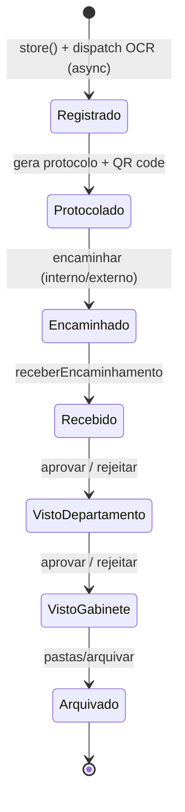
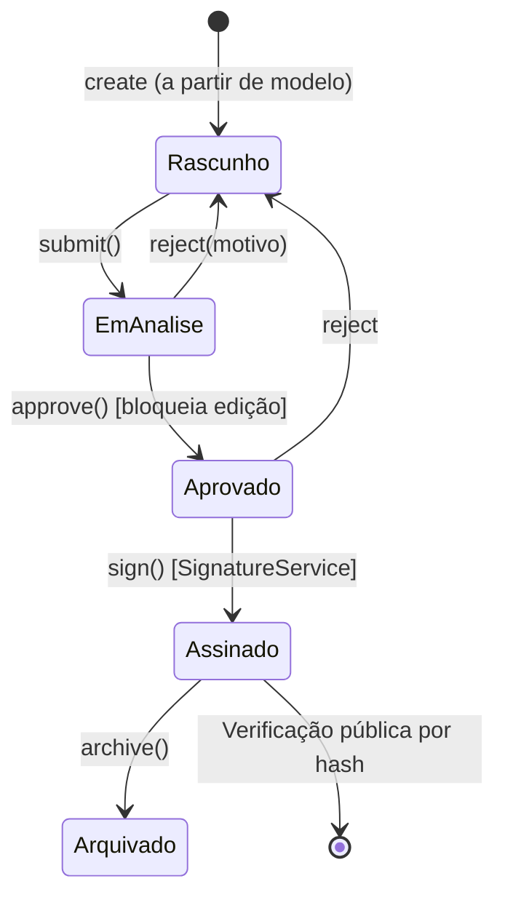
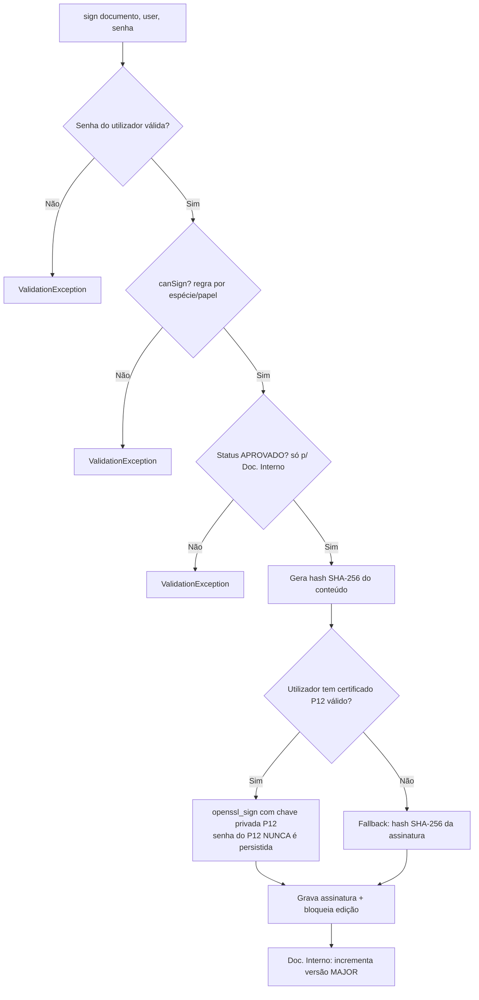
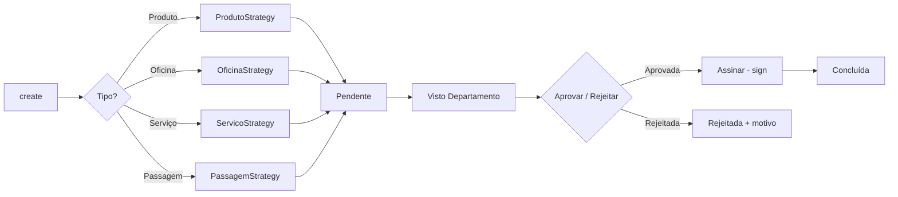
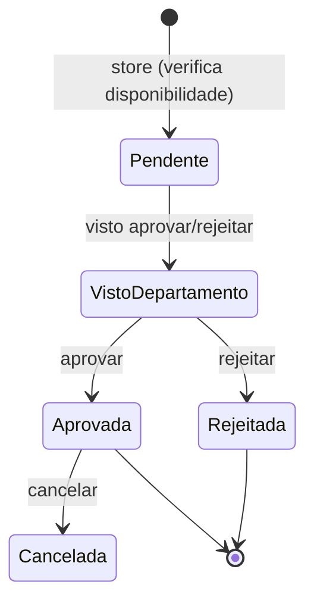

# Fluxos de Negócio — GPN-AGIL

> Workflows (máquinas de estado) dos principais módulos do sistema.
> Complementa o documento de [Arquitetura](ARQUITETURA.md).

---

## 1. Documento de Entrada (protocolo → arquivo)

Documentos recebidos pela instituição são registados, protocolados e roteados internamente
até serem arquivados.



**Recursos associados:**
- **Tarefas** (`DocumentoTarefa`) com responsável, conclusão e cancelamento.
- **Documentos relacionados** (auto-relacionamento N:N via `documento_relacoes`).
- **SLA** — atributo calculado `sla_status` em `DocumentoEntrada`: `normal` / `warning` (≥ 2 dias) /
  `critical` (≥ 5 dias), ignorado para documentos arquivados/finalizados.
- **OCR** — ao anexar imagem/PDF, o job `ProcessarOcrAnexo` extrai o texto para busca.

---

## 2. Documento Interno + Assinatura Digital

Documentos produzidos internamente seguem um workflow de aprovação antes da assinatura.



> A transição de estados é controlada por `DocumentoWorkflowService`, que valida o estado de origem
> antes de cada transição (ex.: apenas *rascunhos* podem ser enviados para análise).

### Verificação pública

Documentos assinados expõem uma rota **pública** (sem autenticação) para validar autenticidade:

```
GET /verificar/documento/{hash}
```

---

## 3. Motor de Assinatura Digital (`SignatureService`)



### Regras de quem pode assinar (`canSign` por espécie)

| Espécie do documento | Quem assina |
|----------------------|-------------|
| **PARECER** | O autor (`criado_por`) |
| **OFÍCIO, CARTA, MEMORANDO, CIRCULAR, DESPACHO** | Chefe de Gabinete (responsável pelo gabinete) |
| **NOTA, REQUERIMENTO, DECLARAÇÃO** | Chefe de Departamento |
| *(Requisição)* | Chefe de Departamento do requisitante |
| **admin** | Sempre pode (override) |

---

## 4. Requisições (Strategy Pattern)

Quatro tipos de requisição compartilham o mesmo fluxo de aprovação, mas têm regras de
criação/validação específicas resolvidas por *strategies*.



### Estados (`StatusRequisicao`)

| Estado | Valor | Cor |
|--------|-------|-----|
| Pendente | `pendente` | warning |
| Assinada | `assinada` | primary |
| Aprovada | `aprovada` | success |
| Rejeitada | `rejeitada` | danger |
| Concluída | `concluida` | info |

Inclui **aprovação em massa** (`requisicoes/aprovar-em-massa`) e **vistos de departamento** em lote
via dashboards de Departamento e Gabinete.

---

## 5. Reserva de Espaços



Possui visão de **calendário** e verificação de disponibilidade em tempo real antes da criação.

---

## Ver também

- [Arquitetura](ARQUITETURA.md) — camadas, estrutura, modelo de dados e infraestrutura.
