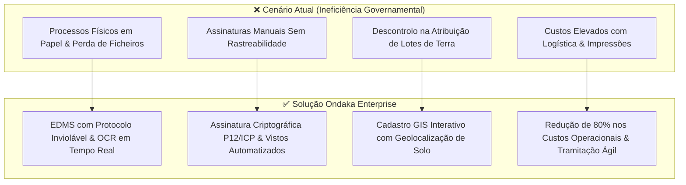
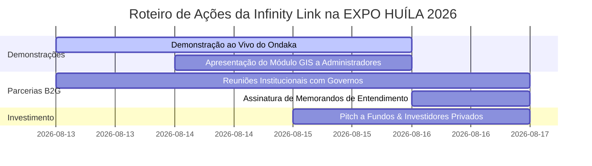

# Dossier Corporativo & Deck de Investimento — Infinity Link
## Plataforma Ondaka Enterprise: Governação Digital, EDMS e Gestão Territorial Inteligente

---

> [!IMPORTANT]
> **Confidencialidade & Propriedade Intelectual**  
> Este documento contém informações estratégicas, financeiras e tecnológicas proprietárias da **Infinity Link, Lda.**. Destina-se exclusivamente a clientes institucionais, parceiros estratégicos e investidores na **EXPO HUÍLA 2026**.

---

## 1. Resumo Executivo & Elevator Pitch

### 1.1 Visão Geral da Startup
A **Infinity Link** é uma GovTech angolana dedicada a liderar a transformação digital das instituições públicas e grandes corporações na África Subsariana. Desenvolvemos o **Ondaka Enterprise**, uma plataforma web integrada de elevada escala que elimina o papel, automatiza os processos burocráticos de despacho e disponibiliza controlo cadastral/territorial georreferenciado em tempo real.

### 1.2 Elevator Pitch (1 Minuto)
> *"Na maioria dos órgãos governamentais e grandes organizações, milhares de processos físicos perdem-se, atrasam despachos críticos e criam opacidade na gestão de terrenos e património. A **Infinity Link** desenvolveu o **Ondaka**, a primeira plataforma GovTech integrada que une Gestão Documental com OCR e IA, Assinatura Eletrónica qualificada com validade jurídica, Cartografia Territorial GIS e Logística de Frotas. Reduzimos o tempo de resposta institucional de semanas para minutos, garantindo 100% de rastreabilidade e integridade legal."*

---

## 2. O Problema vs. A Solução Ondaka

---

## 3. Módulos do Produto — Ondaka Enterprise

### Módulo 1: EDMS & Protocolo Digital Inteligente
* **Entrada & Numeração Inviolável**: Registo de expedição/entrada com código sequencial protegido contra duplicidade por bloqueio de concorrência na BD.
* **Comprovativo de Protocolo**: Impressão e geração instantânea de bilhete de protocolo com código QR para verificação pública de estado.
* **Leitura por OCR & Busca Avançada**: Motor de pesquisa textual que extrai e indexa o conteúdo integral de PDFs digitalizados via Inteligência Artificial.

### Módulo 2: Workflows de Despacho & Assinatura Digital Criptográfica
* **Despachos & Vistos Multinível**: Tramitação transparente entre Departamentos, Chefias de Gabinete e Governo Provincial.
* **Assinatura Eletrónica Qualificada**: Integração nativa com certificados digitais `.p12` / chaves privadas ICP, garantindo não-repúdio e validade jurídica aos atos administrativos.
* **Delegação Temporária de Competências**: Transferência segura de poderes de visto durante impedimentos ou viagens dos titulares.

### Módulo 3: Gestão Territorial & Cadastro GIS (Leaflet.js)
* **Mapa Interativo em Tempo Real**: Visualização georreferenciada de solos e lotes de terra urbanos e rurais da província.
* **Zoneamento e Estado**: Controlo imediato dos lotes quanto ao status (*Disponível, Reservado, Atribuído, Em Licitação*) e zoneamento (*Habitacional, Comercial, Industrial, Agrícola*).

### Módulo 4: Logística, Frota & Requisições Institucionais
* **Gestão de Frotas & Viaturas**: Registo cadastral, diário de bordo e alertas automatizados de manutenção preventiva.
* **Requisições Integradas**: Fluxo digital de pedido, visto e autorização para combustível, materiais de expediente, passagens e serviços.

---

## 4. Arquitetura Tecnológica & Segurança

* **Domain-Driven Design (DDD)**: Camada de domínio isolada com Aggregate Roots (`LoteEntity`, `ViaturaEntity`, `DocumentoEntradaEntity`), DTOs imutáveis e Handlers de comando.
* **Auditoria Integrada**: Registo automático de cada alteração de estado com hash SHA-256 e IP de acesso.
* **Design de Alta Disponibilidade**: Frontend responsivo em Vanilla JS/CSS com suporte a dispositivos móveis e desktops.

---

## 5. Modelo de Negócio (SaaS Enterprise & B2G)

A Infinity Link opera sob o modelo **B2G (Business-to-Government)** e **B2B Enterprise** com receitas recorrentes (ARR):

1. **Subscrição Anual SaaS (Software as a Service)**:
   - **Tier Provincial / Ministerial**: 25.000.000 Kz a 45.000.000 Kz / ano (inclui utilizadores ilimitados, EDMS completo e suporte 24/7).
   - **Tier Municipal / Instituto Público**: 8.000.000 Kz a 15.000.000 Kz / ano.
2. **Serviços Profissionais de Implementação (One-off Setup)**:
   - Formação de quadros públicos, migração de acervo físico legado e configuração de servidores locais/cloud (5.000.000 Kz a 12.000.000 Kz por cliente).
3. **Módulos Adicionais (Add-ons)**:
   - Licenciamento avançado do Módulo Territorial GIS e integração de API externa.

---

## 6. Projeção Financeira (3 Anos em Kwanzas - AOA)

| Indicador Financeiro | Ano 1 (2026) | Ano 2 (2027) | Ano 3 (2028) |
|---|---|---|---|
| **Clientes Ativos (Governos/Municípios)** | 4 Organismos | 12 Organismos | 28 Organismos |
| **Receita Bruta Anual (AOA)** | **120.000.000 Kz** | **380.000.000 Kz** | **950.000.000 Kz** |
| **Custos Operacionais (Infra + Equipa)** | 45.000.000 Kz | 110.000.000 Kz | 240.000.000 Kz |
| **Margem EBITDA (%)** | **62,5%** | **71,0%** | **74,7%** |
| **Lucro Líquido Estimado** | **75.000.000 Kz** | **270.000.000 Kz** | **710.000.000 Kz** |

> [!TIP]
> **Ponto de Equilíbrio (Break-even)**: Alcançado no **6.º mês de operação** com o contrato de 2 Governos Provinciais ativos.

---

## 7. Objetivos Estratégicos na EXPO HUÍLA 2026

1. **Apresentação Comercial & Lançamento**: Realização de demonstrações interativas da plataforma para Governadores, Administradores Municipais e Diretores das províncias da Huíla, Namibe, Cunene e Cuando Cubango.
2. **Assinatura de MoUs / Cartas de Intenção**: Fechar 3 novos acordos piloto de modernização administrativa com municípios da região sul.
3. **Rodada de Investimento Seed/Series A**: Captar 80.000.000 Kz em investimento para acelerar a equipa de engenharia de software e expansão de infraestrutura cloud local.

---

## 8. Contactos Corporativos

* **Empresa**: Infinity Link, Lda.
* **Produto**: Ondaka Enterprise Systems
* **Website**: `https://www.infinitylink.co.ao`
* **E-mail Comercial**: `comercial@infinitylink.co.ao`
* **Contacto Telefónico**: +244 921 598 314 / +244 944 190 901

